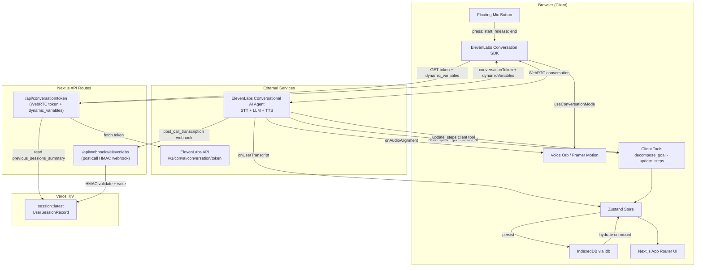
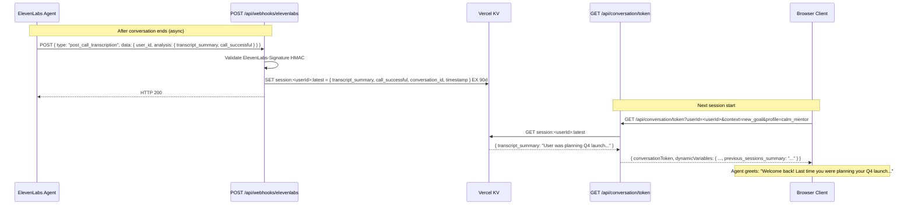

# Design Document: CreativeFlow MVP

## Overview

CreativeFlow is a voice-first, AI-powered smart Todo List PWA where users speak their goals and receive structured, actionable sub-tasks delivered back via text-to-speech. The system uses a **single ElevenLabs Conversational AI Agent** for the entire voice interaction loop — STT, LLM reasoning (task decomposition and progress feedback), and TTS are all handled within the agent. Tone and context are injected as `dynamic_variables` at session start. Client tools bridge the agent to the React UI and Zustand store.

The MVP has three Next.js API routes: a **WebRTC token issuer** (`GET /api/conversation/token`), a **post-call webhook handler** (`POST /api/webhooks/elevenlabs`), and nothing else. The token route encodes the active tone profile, voice ID, and — for progress-update sessions — the current step list and statuses plus `previous_sessions_summary` (fetched from Vercel KV) as `dynamic_variables`. The core interaction loop is: **hold mic → Agent captures speech (STT) → Agent decomposes goal via LLM → calls `decompose_goal` client tool → reads steps back via built-in TTS (step highlighting via `onAudioAlignment`) → user holds mic to report progress → Agent reasons over step context → calls `update_steps` client tool → responds with motivation**. After each session, the post-call webhook receives an LLM-generated transcript summary and stores it in Vercel KV keyed by `userId`, giving the agent cross-session memory.

The UI is a glassmorphic PWA with three main screens: Dashboard (recent flows + voice orb), Projects (active/completed flows), and Profile (settings). A persistent floating mic button enables voice interaction from any screen.

---

## Architecture



---

## Sequence Diagrams

### Flow 1: Goal Creation

```mermaid
sequenceDiagram
    participant U as User
    participant MIC as Mic Button (hold)
    participant TOKEN as /api/conversation/token
    participant KV as Vercel KV
    participant SDK as ElevenLabs Conversation SDK
    participant AGENT as ElevenLabs Agent
    participant STORE as Zustand Store
    participant UI as Dashboard UI

    U->>MIC: Press & hold mic button
    MIC->>TOKEN: GET /api/conversation/token?context=new_goal&profile=calm_mentor&userId=...
    TOKEN->>KV: GET session:<userId>:latest
    KV-->>TOKEN: { transcript_summary } (or empty)
    TOKEN-->>MIC: { conversationToken, dynamicVariables: { tone_profile, voice_id, context, previous_sessions_summary? } }
    MIC->>SDK: startSession({ conversationToken, userId, dynamicVariables, clientTools })
    SDK<-->AGENT: WebRTC conversation open
    U->>SDK: Speak goal (audio captured by SDK)
    SDK-->>STORE: onUserTranscript → setTranscript()
    SDK-->UI: useConversationMode → isSpeaking/isListening → orb animates
    U->>MIC: Release mic button
    SDK->>AGENT: End of utterance signalled (hold released)
    AGENT->>SDK: Call decompose_goal client tool ({ steps: [...] })
    SDK->>STORE: decompose_goal handler → Zod validate → addTask()
    STORE-->>UI: Stagger-animate new task cards
    AGENT->>SDK: Speak steps via built-in TTS (tone from dynamic_variables)
    SDK-->UI: useConversationMode → isSpeaking → orb animates
    loop For each step spoken
        SDK-->>UI: onAudioAlignment(charText, startMs, endMs)
        UI->>STORE: match charText → stepId → setAudioPlaying(true, stepId)
        STORE-->>UI: Highlight active step card
    end
    SDK-->UI: useConversationMode → idle (session ends after TTS)
    AGENT-->WEBHOOK: post_call_transcription webhook (async)
```

### Flow 2: Progress Update

```mermaid
sequenceDiagram
    participant U as User
    participant MIC as Mic Button (hold)
    participant TOKEN as /api/conversation/token
    participant KV as Vercel KV
    participant SDK as ElevenLabs Conversation SDK
    participant AGENT as ElevenLabs Agent
    participant STORE as Zustand Store
    participant UI as Projects UI

    U->>MIC: Press & hold mic button (on project detail view)
    MIC->>TOKEN: GET /api/conversation/token?context=progress_update&todoId=...&userId=...
    TOKEN->>KV: GET session:<userId>:latest
    KV-->>TOKEN: { transcript_summary } (or empty)
    TOKEN-->>MIC: { conversationToken, dynamicVariables: { tone_profile, voice_id, context, goal, steps JSON, previous_sessions_summary? } }
    MIC->>SDK: startSession({ conversationToken, userId, dynamicVariables, clientTools })
    SDK<-->AGENT: WebRTC conversation open (agent has full step context)
    U->>SDK: "I've done 9,000 steps" (audio via SDK)
    U->>MIC: Release mic button
    SDK-->>STORE: onUserTranscript → setTranscript()
    AGENT->>SDK: Call update_steps client tool ({ results: [{ stepId, status }] })
    SDK->>STORE: update_steps handler → completeStep / requestClarification
    STORE-->>UI: Strikethrough completed step, update progress bar
    AGENT->>SDK: Speak motivational response via built-in TTS
    SDK-->UI: useConversationMode → isSpeaking → play motivational audio
    SDK-->UI: useConversationMode → idle (session ends)
    AGENT-->WEBHOOK: post_call_transcription webhook (async)
```

---

### Flow 3: Cross-Session Memory



---

## Components and Interfaces

### Component 1: VoiceOrb

**Purpose**: Animated visual indicator of voice activity state, rendered on the Dashboard.

**Interface**:
```typescript
interface VoiceOrbProps {
  state: 'idle' | 'listening' | 'processing' | 'speaking'
  onMicPress: () => void
  onMicRelease: () => void
}
```

**Responsibilities**:
- Render animated orb using Framer Motion, synced to audio state
- Emit mic press/release events to the voice session controller
- Reflect `reducedMotion` preference (opacity-only transitions)

---

### Component 2: FloatingMicButton

**Purpose**: Persistent mic button accessible from all screens.

**Interface**:
```typescript
interface FloatingMicButtonProps {
  isListening: boolean
  onPress: () => void
  onRelease: () => void
  disabled?: boolean
}
```

**Responsibilities**:
- Fixed-position overlay rendered in root layout
- Disabled during TTS playback to prevent feedback loops
- Triggers `startVoiceSession` / `stopVoiceSession` on the audio controller

---

### Component 3: TodoCard

**Purpose**: Displays a single Todo item with its sub-steps and progress.

**Interface**:
```typescript
interface TodoCardProps {
  todo: TodoItem
  onOpen: (id: string) => void
  isActive?: boolean
}
```

**Responsibilities**:
- Render goal title, progress bar (completed/total steps), domain tag
- Animate entrance via Framer Motion `layoutId`
- Show trophy icon when all steps are completed

---

### Component 4: StepList

**Purpose**: Renders the ordered list of sub-steps within a Todo detail view.

**Interface**:
```typescript
interface StepListProps {
  steps: TodoStep[]
  activeStepId: string | null
}
```

**Responsibilities**:
- Strikethrough completed steps
- Highlight the currently-being-read step during TTS
- Pulse animation on `clarification_needed` steps

---

### Component 5: VoiceSessionController (Hook)

**Purpose**: Orchestrates the ElevenLabs Agent conversation lifecycle and bridges SDK events to the Zustand store.

**Interface**:
```typescript
// Uses @elevenlabs/react granular hooks (preferred for render performance)
import {
  ConversationProvider,
  useConversationControls,  // stable action refs, no re-renders
  useConversationStatus,    // status: 'disconnected' | 'connecting' | 'connected'
  useConversationMode,      // isSpeaking, isListening
  useConversationInput,     // isMuted, setMuted
  useConversationFeedback,  // canSendFeedback, sendFeedback
  useConversationClientTool // register tools from component scope
} from "@elevenlabs/react";

interface UseVoiceSessionReturn {
  start: (profile: ToneProfile, context: SessionContext, todoId?: string) => Promise<void>
  stop: () => void
  sendContextualUpdate: (message: string) => void
  status: 'disconnected' | 'connecting' | 'connected'
  isSpeaking: boolean
  isListening: boolean
  error: Error | null
}
```

**Responsibilities**:
- Fetch a `conversationToken` + `dynamicVariables` from `GET /api/conversation/token?profile=<tone>&context=<ctx>&userId=<id>` before starting
- Call `startSession({ conversationToken, userId, dynamicVariables })` on mic press
- Use `useConversationClientTool` hook to register `decompose_goal` and `update_steps` handlers at component scope so they have access to current Zustand state
- Forward `onUserTranscript` events to `store.setTranscript()`
- Wire `onAudioAlignment` to step text matching: as agent speech alignment events fire, match `charText` against known step texts and call `store.setAudioPlaying(true, matchedStepId)`
- Expose `sendContextualUpdate` so UI can silently notify the agent when users tap steps during an active session (e.g. "User manually marked Step 2 as done via tap")
- Expose `getOutputByteFrequencyData()` and `getInputByteFrequencyData()` to drive orb frequency visualization
- Trigger audio ducking based on `useConversationMode` speaking state

---

### Component 6: SessionHistoryBridge

**Purpose**: Reads and writes cross-session memory. On mount, hydrates `store.userId` from `localStorage`. On conversation end, the Vercel KV write is handled server-side by the webhook handler — this component only reads the summary back into the store when the token route returns it.

---

## Data Models

### Model 1: TodoItem

```typescript
interface TodoItem {
  id: string                    // crypto.randomUUID()
  goal: string                  // Original spoken intent
  domain: string                // e.g. "fitness", "creative", "work"
  steps: TodoStep[]
  status: 'active' | 'completed' | 'archived'
  toneProfile: ToneProfile
  createdAt: number             // Unix timestamp
  updatedAt: number
  completedAt?: number
}
```

**Validation Rules**:
- `steps.length` must be between 2 and 6 (enforced by Zod on LLM response)
- `goal` must be non-empty string, max 500 chars
- `id` must be a valid UUID v4

---

### Model 2: TodoStep

```typescript
interface TodoStep {
  id: string
  text: string
  domainTag: string
  estimatedMinutes: number
  status: 'pending' | 'completed' | 'clarification_needed' | 'unmatched'
  completedAt?: number
}
```

**Validation Rules**:
- `text` must be non-empty, max 200 chars
- `estimatedMinutes` must be a positive integer
- `status` transitions: `pending` → `completed` | `clarification_needed` | `unmatched`

---

### Model 3: AgentContextPayload

```typescript
interface AgentContextPayload {
  todoId: string
  goal: string
  toneProfile: ToneProfile
  steps: {
    id: string
    text: string
    status: TodoStep['status']
    estimatedMinutes: number
  }[]
  completedCount: number
  remainingCount: number
  userTranscript: string        // Latest spoken progress update
  previous_sessions_summary?: string // From Vercel KV; absent on first session
}
```

---

### Model 4: ToneProfile

```typescript
type ToneProfile = 'calm_mentor' | 'hype_coach' | 'gentle_guide'

interface ToneConfig {
  voiceId: string               // ElevenLabs voice ID — injected as dynamic_variable at session start
  label: string
  description: string
}

const TONE_CONFIGS: Record<ToneProfile, ToneConfig> = {
  calm_mentor:  { voiceId: '...', label: 'Calm Mentor',   description: 'Measured, wise, grounding' },
  hype_coach:   { voiceId: '...', label: 'Hype Coach',    description: 'Energetic, motivating, bold' },
  gentle_guide: { voiceId: '...', label: 'Gentle Guide',  description: 'Soft, encouraging, patient' },
}
// The single ELEVENLABS_AGENT_ID is used for all profiles.
// /api/conversation/token passes { tone_profile, voice_id } as dynamic_variables,
// which the agent's system prompt references via {{tone_profile}} and {{voice_id}}.
```

---

### Model 5: Zustand Store Shape

```typescript
interface AppStore {
  // Session
  session: {
    active: boolean
    domain: string | null
    voiceState: VoiceSessionState
    transcript: string
    userId: string            // crypto.randomUUID() persisted to localStorage
  }

  // Tasks
  tasks: TodoItem[]

  // Audio
  audio: {
    playing: boolean
    currentStepId: string | null
    toneProfile: ToneProfile
  }

  // Session History (cross-session memory)
  sessionHistory: {
    summary: string | null      // previous_sessions_summary from last KV read
    lastConversationId: string | null
  }

  // UI
  ui: {
    theme: 'dark' | 'light'
    reducedMotion: boolean
    activeView: 'dashboard' | 'projects' | 'profile'
  }

  // Actions
  addTask: (item: TodoItem) => void
  completeStep: (todoId: string, stepId: string) => void
  requestClarification: (todoId: string, stepId: string, query: string) => void
  setVoiceState: (state: VoiceSessionState) => void
  setTranscript: (text: string) => void
  setAudioPlaying: (playing: boolean, stepId?: string) => void
  setActiveContext: (context: 'new_goal' | 'progress_update', todoId?: string) => void
  setSessionSummary: (summary: string, conversationId: string) => void
  setUserId: (id: string) => void
  hydrateFromDB: () => Promise<void>
  persistToDB: () => Promise<void>
}
```

---

### Model 6: UserSessionRecord

```typescript
// Stored in Vercel KV under key: session:<userId>:latest
interface UserSessionRecord {
  transcript_summary: string    // LLM-generated summary from ElevenLabs analysis
  call_successful: 'success' | 'failure' | 'unknown'
  conversation_id: string       // ElevenLabs conversation ID
  timestamp: number             // Unix timestamp
}
```

**Storage**: Vercel KV with 90-day TTL (`EX 7776000`). Key format: `session:<userId>:latest`.

---

## Error Handling

### Error Scenario 1: Agent Session Connection Failure

**Condition**: `Conversation.startSession()` fails (network error, invalid signed URL, mic permission denied).
**Response**: If mic permission is denied, render a guidance modal with browser-specific instructions and disable the mic button. For network/token errors, set `voiceState = 'error'` and render fallback text input with a mic icon.
**Recovery**: Fallback text input submits directly to the `decompose_goal` or `update_steps` client tool handler, bypassing the agent session.

### Error Scenario 2: Agent `decompose_goal` Tool Returns Invalid Payload

**Condition**: The agent calls `decompose_goal` but the payload fails Zod validation (e.g. `steps.length < 2` or `steps.length > 6`).
**Response**: Show inline error toast. Do not create a TodoItem.
**Recovery**: Retry button sends a text message to the active agent session re-requesting decomposition.

### Error Scenario 3: Agent TTS / Session Drop

**Condition**: The ElevenLabs Conversation session drops mid-TTS (SDK `onDisconnect` fires while `voiceState === 'speaking'`).
**Response**: Display the last known transcript as text on screen. Set `voiceState = 'idle'`.
**Recovery**: User can hold mic again to start a new session.

### Error Scenario 4: Progress Update — No Step Matched

**Condition**: Agent's LLM cannot confidently map the spoken update to any step and calls `update_steps` with all statuses as `unmatched`.
**Response**: Gentle shake animation on all step cards. Agent speaks a redirect prompt ("I didn't quite catch that — could you tell me which step you completed?").
**Recovery**: User holds mic again; agent receives a fresh utterance in the same context.

### Error Scenario 5: `/api/conversation/token` Failure

**Condition**: The token endpoint returns non-2xx (e.g. missing env vars, ElevenLabs API error).
**Response**: Show an error toast. Mic button remains disabled until the page is reloaded.
**Recovery**: Operator fixes server-side configuration; user reloads the app.

### Error Scenario 6: Post-Call Webhook Delivery Failure

**Condition**: `POST /api/webhooks/elevenlabs` returns non-2xx or Vercel KV write fails.
**Response**: ElevenLabs retries webhook delivery per platform retry policy (auto-disabled after 10 consecutive failures with last success > 7 days ago). Cross-session memory is degraded — the agent starts as if it's a fresh session — but all other functionality is unaffected.
**Recovery**: Webhook delivery resumes automatically when the endpoint recovers. No manual user action required.

---

## Testing Strategy

### Unit Testing Approach

Test Zustand store actions in isolation using Vitest. Validate all Zod schemas against valid and invalid payloads.

**Key unit test cases**:
- `completeStep` correctly transitions step status and updates `updatedAt`
- Zod schema rejects `steps.length < 2` and `steps.length > 6`
- `hydrateFromDB` correctly restores store state from IndexedDB mock
- `ToneConfig` lookup returns correct `voiceId` for each profile
- `decompose_goal` client tool handler creates a valid `TodoItem` from agent payload
- `update_steps` client tool handler correctly maps agent result to `completeStep` / `requestClarification`

### Property-Based Testing Approach

Use `fast-check` to verify invariants across arbitrary inputs.

**Property Test Library**: fast-check

**Key properties**:
- For any `TodoItem`, `completedCount` always equals `steps.filter(s => s.status === 'completed').length`
- For any valid context payload, `completedCount + remainingCount` always equals `steps.length`
- Step status transitions are monotonic: a `completed` step never reverts to `pending`
- Hydration idempotency: `hydrateFromDB()` called twice produces the same store state

### Integration Testing Approach

Mock the ElevenLabs Conversation SDK (`@elevenlabs/client`) to simulate `onUserTranscript`, `onStatusChange`, and client tool invocations without a live agent connection. Use MSW to mock `/api/conversation/token`. Verify the full client-side flow (mic press → store update → UI render) end-to-end with mocked agent events.

---

## Performance Considerations

- STT first token target: <600ms — measured via SDK's first `onUserTranscript` event after mic press
- LLM response p95 target: <1200ms — measured from mic release to `decompose_goal` / `update_steps` tool invocation
- TTS stream start target: <900ms — measured at SDK's first `onAudioChunk` event after agent finishes reasoning
- Bundle size target: <120KB gzipped — enforce via `webpack-bundle-analyzer` in CI
- Non-critical state updates (e.g. `persistToDB`) deferred via `requestIdleCallback` during agent speech
- Agent sessions are short-lived (one interaction per hold) to minimise WebSocket idle time

---

## Security Considerations

- `ELEVENLABS_API_KEY`, `ELEVENLABS_AGENT_ID`, and `ELEVENLABS_WEBHOOK_SECRET` stored exclusively in `process.env`, never exposed to the client bundle
- The client receives only a short-lived **WebRTC conversation token** from `/api/conversation/token`; the token expires and cannot be reused
- `/api/conversation/token` validates the `context` and `profile` query parameters; unknown values are rejected with 400
- `POST /api/webhooks/elevenlabs` validates the `ElevenLabs-Signature` HMAC header on every request; the raw body is used for verification per ElevenLabs SDK `constructEvent()` guidance
- All API routes include `Cache-Control: no-store` and `X-Content-Type-Options: nosniff`
- CORS restricted to `process.env.NEXT_PUBLIC_APP_URL`
- No raw audio stored — only transcripts, persisted locally with 30-day auto-purge; Vercel KV stores only LLM-generated summaries (no raw transcripts) with 90-day TTL
- Anonymous session IDs only via `crypto.randomUUID()` — no PII collected
- CSP: `default-src 'self'; script-src 'self' 'unsafe-inline' https://elevenlabs.io; connect-src 'self' https://api.elevenlabs.io wss://*.elevenlabs.io`

---

## Dependencies

| Package | Version | Purpose |
|---------|---------|---------|
| `next` | ^14.2.0 | App framework + API routes |
| `typescript` | ^5.4.0 | Type safety |
| `tailwindcss` | ^3.4.0 | Utility-first styling |
| `framer-motion` | ^11.0.0 | Animations, layout transitions |
| `zustand` | ^4.5.0 | Client state management |
| `@elevenlabs/client` | latest | Conversation SDK (STT + Agent + TTS) |
| `@elevenlabs/react` | latest | `ConversationProvider`, granular hooks (`useConversationControls`, `useConversationMode`, `useConversationStatus`, `useConversationClientTool`, etc.) |
| `@vercel/kv` | latest | Serverless Redis KV for cross-session memory (UserSessionRecord) |
| `idb` | ^7.1.0 | IndexedDB wrapper for persistence |
| `zod` | ^3.x | Schema validation for agent client tool payloads |
| `msw` | ^2.x | API + SDK mocking for integration tests |
| `fast-check` | ^3.x | Property-based testing |
| `vitest` | ^1.x | Unit + property test runner |
| `next-pwa` | latest | PWA manifest + service worker |

---

## Low-Level Design

### Key Functions with Formal Specifications

#### `startVoiceSession(profile: ToneProfile, context: 'new_goal' | 'progress_update', todoId?: string, userId: string)`

```typescript
async function startVoiceSession(
  profile: ToneProfile,
  context: 'new_goal' | 'progress_update',
  todoId: string | undefined,
  userId: string
): Promise<void>
```

**Preconditions:**
- No active conversation session
- `context === 'progress_update'` implies `todoId` is provided and exists in `tasks[]`
- `userId` is a valid UUID persisted in `localStorage`

**Postconditions:**
- `GET /api/conversation/token` called with `profile`, `context`, `todoId` (if progress), and `userId`
- Server returns `{ conversationToken, dynamicVariables }` (WebRTC token from `GET /v1/convai/conversation/token`; `dynamicVariables` includes `previous_sessions_summary` if KV record exists)
- `startSession({ conversationToken, userId, dynamicVariables })` is called
- `session.active === true`
- `voiceState === 'listening'`
- `transcript` is reset to `''`

**Error path**: If token fetch fails or mic is denied, set `voiceState = 'error'` and emit `SESSION_START_FAILED` event.

---

#### `stopVoiceSession()`

```typescript
function stopVoiceSession(): void
```

**Preconditions:**
- `session.active === true`

**Postconditions:**
- Conversation session is ended via SDK `endSession()`
- `session.active === false`
- `voiceState === 'processing'` until agent responds, then transitions to `'speaking'` → `'idle'`

---

#### `handleDecomposeGoal(payload: DecomposeGoalPayload)`

```typescript
function handleDecomposeGoal(payload: DecomposeGoalPayload): { success: boolean }
```

This is the **`decompose_goal` client tool handler** invoked by the ElevenLabs Agent.

**Preconditions:**
- `payload.steps` is a non-empty array

**Postconditions:**
- Payload is validated with Zod (`2 <= steps.length <= 6`)
- A valid `TodoItem` is created and dispatched via `addTask()`
- Returns `{ success: true }` to the agent on success; `{ success: false, error }` on validation failure

**Error path**: Zod failure → show error toast, return `{ success: false }`, do not create TodoItem.

---

#### `handleUpdateSteps(payload: UpdateStepsPayload)`

```typescript
function handleUpdateSteps(payload: UpdateStepsPayload): { success: boolean }
```

This is the **`update_steps` client tool handler** invoked by the ElevenLabs Agent after progress reasoning.

**Preconditions:**
- `payload.todoId` exists in `tasks[]`
- `payload.results` is a non-empty array of `{ stepId, status }`

**Postconditions:**
- For each result: `completeStep()` or `requestClarification()` is dispatched to Zustand
- A `completed` step's status never reverts to `pending`
- Returns `{ success: true }` to the agent

---

#### `hydrateFromDB()`

```typescript
async function hydrateFromDB(): Promise<void>
```

**Preconditions:**
- IndexedDB `sessions` store is accessible
- Called only on app mount (before any user interaction)

**Postconditions:**
- If a persisted session exists: `tasks[]` is populated from DB
- If no session exists: `tasks[]` remains `[]`, empty state is rendered
- `session.active === false` regardless of persisted state

---

### Algorithmic Pseudocode

#### Main Voice Interaction Loop

```pascal
ALGORITHM voiceInteractionLoop
INPUT: userMicEvent (press | release), activeContext ('new_goal' | 'progress_update')
OUTPUT: side effects on Zustand store + UI

BEGIN
  ON press:
    userId ← READ localStorage 'creativeflow-userId'
    IF activeContext = 'new_goal' THEN
      { conversationToken, dynamicVariables } ← CALL GET /api/conversation/token(profile, context='new_goal', userId)
    ELSE
      { conversationToken, dynamicVariables } ← CALL GET /api/conversation/token(profile, context='progress_update', todoId, userId)
    END IF
    
    CALL startSession({ conversationToken, userId, dynamicVariables })
    SET voiceState ← 'listening'
    SET transcript ← ''
    
    WHILE session is connected DO
      ON onUserTranscript(chunk):
        APPEND chunk TO session.transcript
        DISPATCH setTranscript(session.transcript)
      ON useConversationMode change (isSpeaking / isListening):
        DISPATCH setVoiceState(mode)
      ON onAudioAlignment(alignmentData):
        matchedStepId ← MATCH alignmentData.charText AGAINST steps[].text
        IF matchedStepId ≠ null THEN
          DISPATCH setAudioPlaying(true, matchedStepId)
        END IF
    END WHILE

  ON release:
    CALL endSession()  -- signals end-of-utterance to agent
    SET voiceState ← 'processing'
    
    -- Agent reasons internally, then calls client tools:
    ON decompose_goal(payload):           -- if new_goal context
      CALL handleDecomposeGoal(payload)   -- Zod validate → addTask()
    ON update_steps(payload):             -- if progress_update context
      CALL handleUpdateSteps(payload)     -- completeStep / requestClarification
    
    SET voiceState ← 'speaking'  -- driven by useConversationMode from SDK
    AWAIT session onDisconnect
    SET voiceState ← 'idle'
    SCHEDULE persistToDB() VIA requestIdleCallback
END
```

**Preconditions:**
- `session.activeContext` is set before mic press
- `ELEVENLABS_AGENT_ID` is configured server-side

**Postconditions:**
- `voiceState` returns to `'idle'` after agent session ends
- Store state reflects all step status changes
- `persistToDB()` is called via `requestIdleCallback` after state mutation

**Loop Invariants:**
- While connected: `session.transcript` only grows (append-only)
- While processing update_steps: previously processed steps retain their computed status

---

#### IndexedDB Persistence Algorithm

```pascal
ALGORITHM persistToDB
INPUT: current Zustand store state
OUTPUT: persisted session in IndexedDB

BEGIN
  session ← {
    id: session.id,
    tasks: store.tasks,
    audio: { toneProfile: store.audio.toneProfile },
    savedAt: Date.now()
  }
  
  OPEN IndexedDB 'creativeflow-db' version 1
  
  IF db.objectStoreNames DOES NOT CONTAIN 'sessions' THEN
    CREATE objectStore 'sessions' WITH keyPath 'id'
  END IF
  
  tx ← db.transaction('sessions', 'readwrite')
  AWAIT tx.objectStore('sessions').put(session)
  AWAIT tx.done
  
  ASSERT session IS retrievable BY session.id
END
```

---

### Example Usage

```typescript
// 1. App mount — hydrate from IndexedDB + init userId
useEffect(() => {
  store.hydrateFromDB()
  const existing = localStorage.getItem('creativeflow-userId')
  const userId = existing ?? crypto.randomUUID()
  if (!existing) localStorage.setItem('creativeflow-userId', userId)
  store.setUserId(userId)
}, [])

// 2. User presses mic on Dashboard (new goal context)
const { startSession, endSession, sendContextualUpdate } = useConversationControls()
const { isSpeaking, isListening } = useConversationMode()
const { status } = useConversationStatus()

// Register client tools at component scope (auto-unregistered on unmount)
useConversationClientTool('decompose_goal', handleDecomposeGoal)
useConversationClientTool('update_steps', handleUpdateSteps)

const handleMicPress = async () => {
  const userId = store.session.userId
  store.setActiveContext('new_goal')
  const { conversationToken, dynamicVariables } = await fetch(
    `/api/conversation/token?context=new_goal&profile=${store.audio.toneProfile}&userId=${userId}`
  ).then(r => r.json())
  await startSession({ conversationToken, userId, dynamicVariables })
}

const handleMicRelease = () => {
  endSession()  // agent receives end-of-utterance and begins reasoning
}

// 3. User taps a step to manually complete it during an active session
const handleStepTap = (stepId: string, stepText: string) => {
  store.completeStep(todoId, stepId)
  if (status === 'connected') {
    sendContextualUpdate(`User manually marked step "${stepText}" as complete via UI tap.`)
  }
}

// 4. Orb visualization — real audio frequency data, not binary state
const { getOutputByteFrequencyData, getInputByteFrequencyData } = useConversationControls()
// In rAF loop: map amplitude to orb scale/glow
const frequencyData = isSpeaking ? getOutputByteFrequencyData() : getInputByteFrequencyData()
const amplitude = frequencyData ? Math.max(...Array.from(frequencyData)) / 255 : 0

// 5. Rendering a TodoCard with live step highlighting driven by onAudioAlignment
<StepList
  steps={todo.steps}
  activeStepId={audio.currentStepId}
/>

// 6. Tone profile selection
store.setToneProfile('hype_coach')
// Next session start will use TONE_CONFIGS['hype_coach'].voiceId as dynamic_variable
```

---

#### `handlePostCallWebhook(rawBody: string, sigHeader: string): Promise<Response>`

```typescript
async function handlePostCallWebhook(
  rawBody: string,
  sigHeader: string
): Promise<Response>
```

This is the **`POST /api/webhooks/elevenlabs` handler** invoked by ElevenLabs after each conversation ends.

**Preconditions:**
- `ELEVENLABS_WEBHOOK_SECRET` is set in `process.env`
- Vercel KV is accessible

**Postconditions:**
- HMAC signature validated via ElevenLabs SDK `constructEvent(rawBody, sigHeader, secret)`
- On `post_call_transcription` event type: `UserSessionRecord` is written to KV under `session:<userId>:latest` with 90-day TTL (`EX 7776000`)
- Returns `Response(200)` on success; `Response(401)` on signature failure; `Response(500)` on KV error

**Error path**: KV write failure returns 500 — ElevenLabs retries on non-2xx.

---

### Correctness Properties

```typescript
// P1: Progress invariant — completedCount always reflects actual completed steps
assert(
  completedCount ===
    steps.filter(s => s.status === 'completed').length
)

// P2: Step count invariant — completed + remaining never exceeds total
assert(completedCount + remainingCount <= steps.length)

// P3: Step status monotonicity — completed steps never revert
// For any step s: once s.status === 'completed', no action sets it back to 'pending'

// P4: Decompose output validity
assert(newTodo.steps.length >= 2 && newTodo.steps.length <= 6)
newTodo.steps.forEach(s => assert(s.estimatedMinutes > 0 && s.text.length > 0))

// P5: Store hydration idempotency
// hydrateFromDB() called twice produces the same store state as called once

// P6: Client tool handler isolation
// handleDecomposeGoal / handleUpdateSteps never mutate store state directly;
// they only dispatch Zustand actions
```
